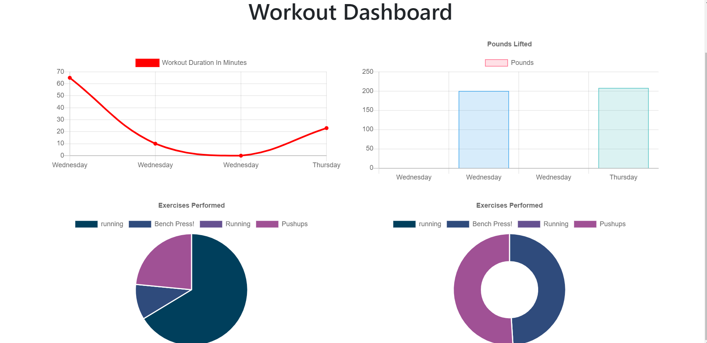

# Workout Tracker

## This application tracks workouts, allowing the user to add different exercises to each individual workouts. It then displays the data in graphs and pie charts based off duration, weights, distance, etc.

[Deployed on Heroku here](#).

